# Penetration Tests

Cecily Black and Micaela Madariaga

## Self Attack

### Cecily

#### Attack 1

| Item           | Result                                                                                 |
| -------------- | -------------------------------------------------------------------------------------- |
| Date           | April 7, 2026                                                                          |
| Target         | https://pizza.jwt-pizza.click                                                          |
| Classification | Identification and Authentication Failures                                             |
| Severity       | 2                                                                                      |
| Description    | I was able to do a brute force attack with several passwords and find one that worked. |
| Images         | 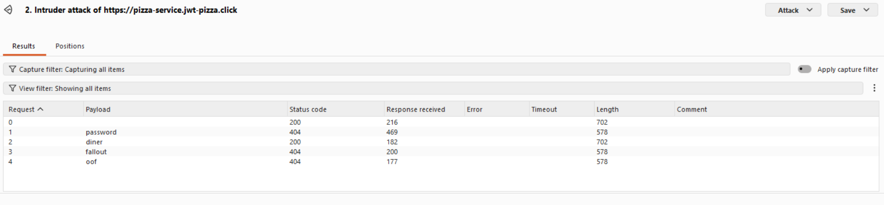                                      |
| Corrections    | Get users to have better passwords.                                                    |

#### Attack 2

| Item           | Result                                                           |
| -------------- | ---------------------------------------------------------------- |
| Date           | April 9th, 2026                                                  |
| Target         | https://pizza.jwt-pizza.click                                    |
| Classification | Broken Access Control                                            |
| Severity       | 0                                                                |
| Description    | I tried to see franchises without being signed in as franchisee. |
| Images         | 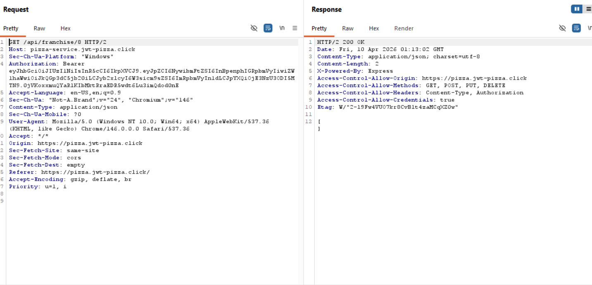                    |
| Corrections    | Attack did not work.                                             |

#### Attack 3

| Item           | Result                                                      |
| -------------- | ----------------------------------------------------------- |
| Date           | April 9th, 2026                                             |
| Target         | https://pizza.jwt-pizza.click                               |
| Classification | Insecure Design                                             |
| Severity       | 2                                                           |
| Description    | Was able to order 5 pizzas for free after altering request. |
| Images         | 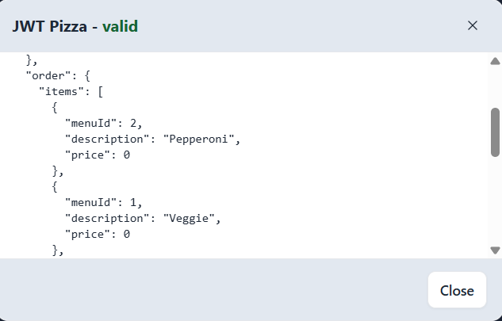             |
| Corrections    | Have extra checks to ensure prices.                         |

#### Attack 4

| Item           | Result                                                                                                                                         |
| -------------- | ---------------------------------------------------------------------------------------------------------------------------------------------- |
| Date           | April 9th, 2026                                                                                                                                |
| Target         | https://pizza.jwt-pizza.click                                                                                                                  |
| Classification | Cryptographic Failures                                                                                                                         |
| Severity       | 0                                                                                                                                              |
| Description    | I tried modifying the JWT token. Did not accept the modified token. Though token could potentially contain information a person could exploit. |
| Images         | 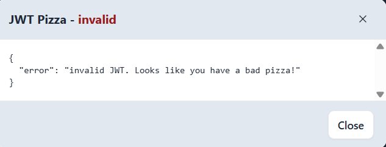                                                                                                |
| Corrections    | Attack did not succeed.                                                                                                                        |

#### Attack 5

| Item           | Result                                                |
| -------------- | ----------------------------------------------------- |
| Date           | April 9th, 2026                                       |
| Target         | https://pizza.jwt-pizza.click                         |
| Classification | SSRF (Server-Side Request Forgery)                    |
| Severity       | 1                                                     |
| Description    | I was able to interrupt calls to images from website. |
| Images         | 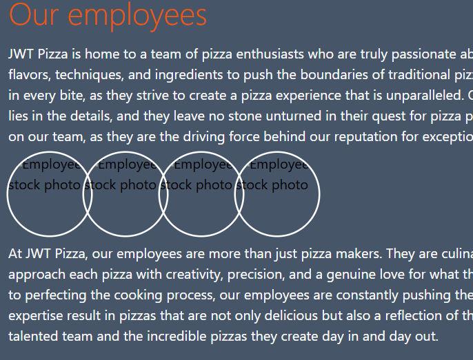                        |
| Corrections    | Hide calls better, keep images internal.              |

### Micaela

#### Attack 1

| Item           | Result                                                                                                                                                                                                                    |
| -------------- | ------------------------------------------------------------------------------------------------------------------------------------------------------------------------------------------------------------------------- |
| Date           | April 10, 2026                                                                                                                                                                                                            |
| Target         | https://pizza.micapizza.click                                                                                                                                                                                             |
| Classification | Broken Access Control                                                                                                                                                                                                     |
| Severity       | 0                                                                                                                                                                                                                         |
| Description    | Tried to use the updateUser endpoint with an authorized user's session token to change other user credentials.                                                                                                            |
| Images         |   The bearer token was not that of an admin's, so it failed. |
| Corrections    | None needed.                                                                                                                                                                                                              |

#### Attack 2

| Item           | Result                                                                                                                                                                                                                                                                                                                                                                                                      |
| -------------- | ----------------------------------------------------------------------------------------------------------------------------------------------------------------------------------------------------------------------------------------------------------------------------------------------------------------------------------------------------------------------------------------------------------- |
| Date           | April 10, 2026                                                                                                                                                                                                                                                                                                                                                                                              |
| Target         | https://pizza.micapizza.click                                                                                                                                                                                                                                                                                                                                                                               |
| Classification | Injection                                                                                                                                                                                                                                                                                                                                                                                                   |
| Severity       | 3                                                                                                                                                                                                                                                                                                                                                                                                           |
| Description    | Used the updateUser endpoint with an authorized account to inject sql into the email field.                                                                                                                                                                                                                                                                                                                 |
| Images         |   The admins email and password were overwritten with the other user's credentials. |
| Corrections    | Harden the logic in updateUser so user input is sanitized.                                                                                                                                                                                                                                                                                                                                                  |

#### Attack 3

| Item           | Result                                                                                                                                                                                                    |
| -------------- | --------------------------------------------------------------------------------------------------------------------------------------------------------------------------------------------------------- |
| Date           | April 10, 2026                                                                                                                                                                                            |
| Target         | https://pizza.micapizza.click                                                                                                                                                                             |
| Classification | Insecure Design                                                                                                                                                                                           |
| Severity       | 2                                                                                                                                                                                                         |
| Description    | Used the order endpoint to set my own price for the pizzas.                                                                                                                                               |
| Images         |   Obtained as many free pizzas as I wanted! |
| Corrections    | Verify prices using the menu instead of trusting the user.                                                                                                                                                |

#### Attack 4

| Item           | Result                                                                                                                                                                                                                                     |
| -------------- | ------------------------------------------------------------------------------------------------------------------------------------------------------------------------------------------------------------------------------------------ |
| Date           | April 11, 2026                                                                                                                                                                                                                             |
| Target         | https://pizza.micapizza.click                                                                                                                                                                                                              |
| Classification | Identification and Authentication Failures                                                                                                                                                                                                 |
| Severity       | 3                                                                                                                                                                                                                                          |
| Description    | Brute-forced passwords for an admin account using Burp Suite.                                                                                                                                                                              |
| Images         |   Found a bug that showed an empty password could return admin information. |
| Corrections    | Harden the logic behind the password checks.                                                                                                                                                                                               |

#### Attack 5

| Item           | Result                                                                                                                                                                                                                    |
| -------------- | ------------------------------------------------------------------------------------------------------------------------------------------------------------------------------------------------------------------------- |
| Date           | April 11, 2026                                                                                                                                                                                                            |
| Target         | https://pizza.micapizza.click                                                                                                                                                                                             |
| Classification | Broken Access Control                                                                                                                                                                                                     |
| Severity       | 3                                                                                                                                                                                                                         |
| Description    | Tried to use the createFranchise endpoint with an authorized user's session token to self-promote.                                                                                                                        |
| Images         |   The bearer token was not that of an admin's, so it failed. |
| Corrections    | None needed.                                                                                                                                                                                                              |

## Peer Attack

### Cecily attack on Micaela: Create an attack record for each attack.

#### Attack 1

| Item           | Result                                            |
| -------------- | ------------------------------------------------- |
| Date           | April 10th, 2026                                  |
| Target         | https://pizza.micapizza.click                     |
| Classification | Identification and Authentication Failures        |
| Severity       | 0                                                 |
| Description    | I attempted to find admin's password, but failed. |
| Images         | 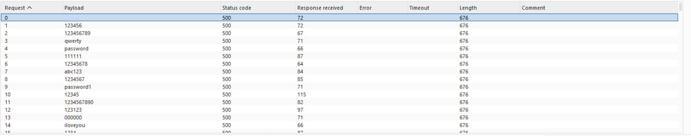                |
| Corrections    | Attack not successful.                            |

#### Attack 2

| Item           | Result                              |
| -------------- | ----------------------------------- |
| Date           | April 10th, 2026                    |
| Target         | https://pizza.micapizza.click       |
| Classification | Insecure Design                     |
| Severity       | 2                                   |
| Description    | I was able to get 10 free pizzas.   |
| Images         | 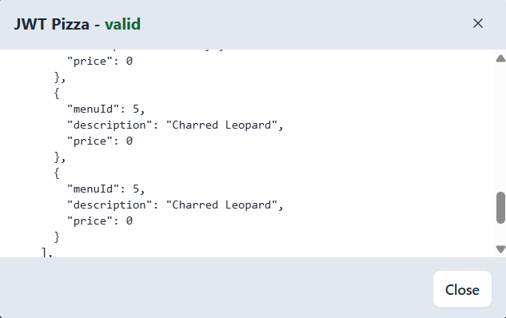 |
| Corrections    | Have extra checks to ensure prices. |

#### Attack 3

| Item           | Result                                                                                  |
| -------------- | --------------------------------------------------------------------------------------- |
| Date           | April 10th, 2026                                                                        |
| Target         | https://pizza.micapizza.click                                                           |
| Classification | SSRF (Server-Side Request Forgery)                                                      |
| Severity       | 1                                                                                       |
| Description    | I was able to replace images with different ones.                                       |
| Images         | 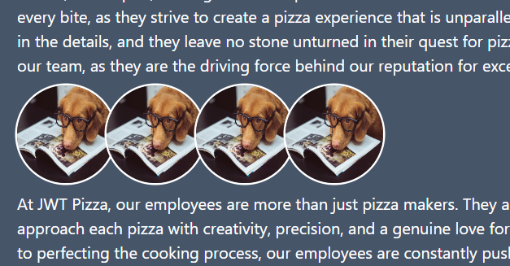   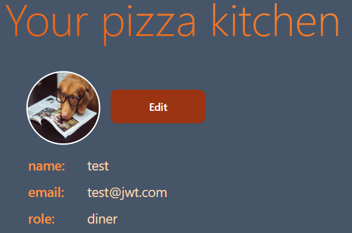 |
| Corrections    | Hide calls better, keep images internal.                                                |

#### Attack 4

| Item           | Result                                          |
| -------------- | ----------------------------------------------- |
| Date           | April 10th, 2026                                |
| Target         | https://pizza.micapizza.click                   |
| Classification | Broken Access Control                           |
| Severity       | 1                                               |
| Description    | I was able to see diner dashboard without auth. |
| Images         | 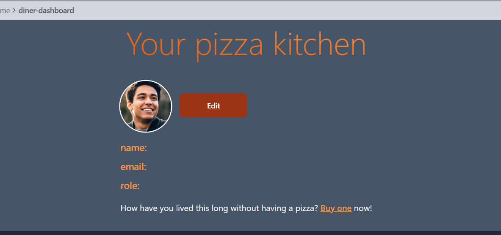          |
| Corrections    | Have more rigorous auth checks.                 |

#### Attack 5

| Item           | Result                                                    |
| -------------- | --------------------------------------------------------- |
| Date           | April 10th, 2026                                          |
| Target         | https://pizza.micapizza.click                             |
| Classification | Cryptographic Failures                                    |
| Severity       | 0                                                         |
| Description    | I tried modifying the auth token to look like franchisee. |
| Images         | 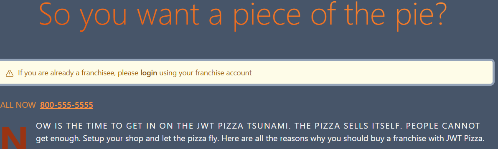                          |
| Corrections    | Attack did not succeed.                                   |

### Micaela attack on Cecily: Create an attack record for each attack.

#### Attack 1

| Item           | Result                                                                                                                                                                                                                                        |
| -------------- | --------------------------------------------------------------------------------------------------------------------------------------------------------------------------------------------------------------------------------------------- |
| Date           | April 11, 2026                                                                                                                                                                                                                                |
| Target         | https://pizza.jwt-pizza.click/                                                                                                                                                                                                                |
| Classification | Security Misconfiguration                                                                                                                                                                                                                     |
| Severity       | 2                                                                                                                                                                                                                                             |
| Description    | Attempted to use default credentials to sign in.                                                                                                                                                                                              |
| Images         |   This did not work with the admin account, but I was able to log in as the existing franchisee member. |
| Corrections    | Update passwords for the default accounts.                                                                                                                                                                                                    |

#### Attack 2

| Item           | Result                                                                                                                                                                                                             |
| -------------- | ------------------------------------------------------------------------------------------------------------------------------------------------------------------------------------------------------------------ |
| Date           | April 11, 2026                                                                                                                                                                                                     |
| Target         | https://pizza.jwt-pizza.click/                                                                                                                                                                                     |
| Classification | Identification and Authentication Failures                                                                                                                                                                         |
| Severity       | 3                                                                                                                                                                                                                  |
| Description    | Attempted brute forcing the passwords for the admin account.                                                                                                                                                       |
| Images         |  Found that an empty password could be used to gain an admin session token. |
| Corrections    | Hardening password checks in the backend logic.                                                                                                                                                                    |

#### Attack 3

| Item           | Result                                                                                                                                                                                          |
| -------------- | ----------------------------------------------------------------------------------------------------------------------------------------------------------------------------------------------- |
| Date           | April 11, 2026                                                                                                                                                                                  |
| Target         | https://pizza.jwt-pizza.click/                                                                                                                                                                  |
| Classification | Insecure Design                                                                                                                                                                                 |
| Severity       | 3                                                                                                                                                                                               |
| Description    | Used the order endpoint to manually change the pizza prices in the request body.                                                                                                                |
| Images         |  Was able to order 30 free pizzas! |
| Corrections    | Change format of request so users can't submit the price (should be verified on the backend).                                                                                                   |

#### Attack 4

| Item           | Result                                                                                                                                                                                                                                       |
| -------------- | -------------------------------------------------------------------------------------------------------------------------------------------------------------------------------------------------------------------------------------------- |
| Date           | April 11, 2026                                                                                                                                                                                                                               |
| Target         | https://pizza.jwt-pizza.click/                                                                                                                                                                                                               |
| Classification | Injection                                                                                                                                                                                                                                    |
| Severity       | 3                                                                                                                                                                                                                                            |
| Description    | Used the updateUser endpoint with an authorized user to inject sql that changes admin credentials.                                                                                                                                           |
| Images         |  Successfully logged in as admin with the changed credentials and was able to delete users/franchises. |
| Corrections    | Make sure that user params are handled correctly in the backend.                                                                                                                                                                             |

#### Attack 5

| Item           | Result                                                                                                                                                                                            |
| -------------- | ------------------------------------------------------------------------------------------------------------------------------------------------------------------------------------------------- |
| Date           | April 11, 2026                                                                                                                                                                                    |
| Target         | https://pizza.jwt-pizza.click/                                                                                                                                                                    |
| Classification | Broken Access Control                                                                                                                                                                             |
| Severity       | 3                                                                                                                                                                                                 |
| Description    | Used the deleteFranchise endpoint with an authorized user's session token.                                                                                                                        |
| Images         |  Successfully deleted any franchise. |
| Corrections    | Add an admin authorization check to this endpoint so that ordinary users can't delete anything.                                                                                                   |

## Combined summary of learnings

We learned a lot from all of this! It was really cool to find out about Burp Suite and how it works. Playing around to see what we could break or get into was an enjoyable challenge. 

Something we learned from this experience is how much of a layered process it can be. There were many times when, in preparation for an attack, we first had to go through a number of other steps to collect the necessary information. Sometimes this meant making certain calls to learn which endpoints to call with which request bodies, then finding and copying certain session tokens for use in later requests, registering new users, and even making new franchises/stores/orders. Even then, we saw how attacks could be built upon each other until the most damage had been done. For example, a preliminary attack maybe started with something simpler like altering endpoint response bodies that then paved the way for admin credentials to be stolen.

This deliverable definitely made us more aware of how things could be vulnerable for attack. Even when we were not fully skilled enough to make an attack work, it definitely showed us how much effort and conscious thought need to go into ensuring that a website is secure and safe. Some of the types of attacks we learned about were entirely new for us as well, which was quite interesting to learn more about and try. Overall, this was a pretty cool deliverable that was eye-opening!
